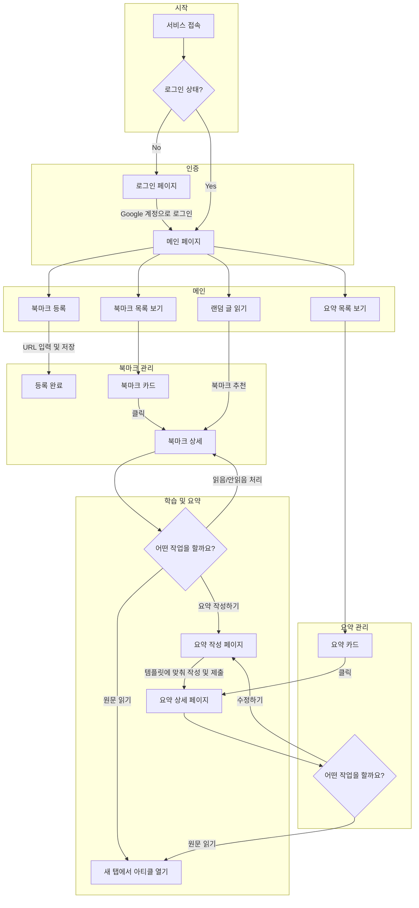
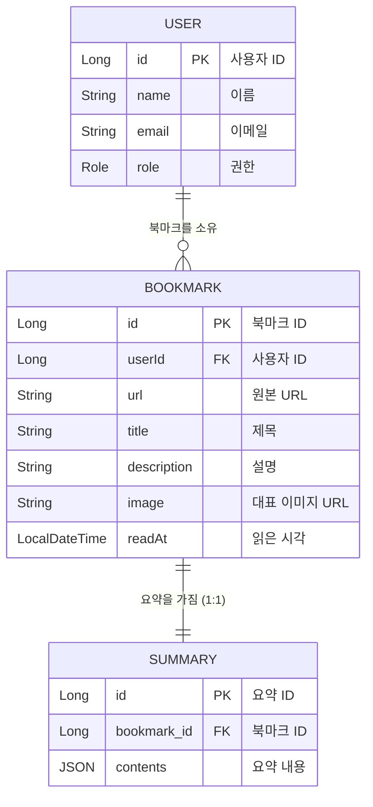

# 📖 My Wiki - 당신의 지식 저장소

**My Wiki**는 단순한 북마크 서비스를 넘어, 집단지성을 이용해 거대하고 효율적인 지식 저장소를 구축하는 것을 목표로 하는 프로젝트입니다.

My Wiki는 여러분이 웹 서핑 중 발견한 유용한 아티클이나 블로그 글을 저장하고, 체계적인 요약 템플릿 기반으로 요약문을 작성해 학습 효과를 극대화할 수 있도록 하며, 요약 복기를 통해 학습한 지식을 온전히
자신의 것으로 만들 수 있도록 돕습니다!

### 지금 바로 이용해보세요!! >>> https://my-wiki.kro.kr

---

## 🤔 My Wiki는 어떤 서비스인가요?

My Wiki는 정보의 홍수 속에서 핵심만 명확하게 파악하고, 장기 기억으로 전환할 수 있도록 설계되었습니다.

1. **🎯 습관 형성**: 꾸준한 학습과 기록을 통해 지식을 쌓아가는 습관을 만들어줍니다. '랜덤 글 읽기' 기능으로 어떤 글부터 읽어야 할지 모를 때 좋은 길잡이가 되어줍니다.
2. **✍️ 학습 효과 극대화**: 구조화된 요약 템플릿을 제공하여, 글의 핵심을 파악하고 자신의 생각을 정리하며 학습 효과를 극대화할 수 있습니다.
3. **🧠 장기 기억 전환**: 단순히 읽고 끝나는 것이 아니라, 요약문을 다시 읽어보며 중요한 정보를 리마인드하고 장기 기억으로 전환하는 과정을 지원합니다.

---

## ✨ 주요 기능

- **Google 소셜 로그인**: 복잡한 회원가입 없이 Google 계정으로 간편하게 시작할 수 있습니다. 추후 크롬 확장프로그램을 통해 더욱 쉽게 북마크를 저장할 수 있도록 기능을 제공할 예정이에요!
- **북마크**: 읽고 싶은 웹 아티클을 손쉽게 저장하고 관리합니다.
- **요약 템플릿**: `핵심 파악` - `세부 내용 정리` - `사고 확장`으로 이어지는 체계적인 템플릿으로 깊이 있는 요약을 작성할 수 있습니다.
- **요약문 모아보기**: 작성한 요약문들을 한눈에 보고, 과거에 학습한 내용을 쉽게 복습할 수 있습니다.
- **랜덤 글 추천**: 어떤 글을 읽을지 결정하기 어려우신가요? 저장된 북마크 중 무작위 글을 오픈하여 꾸준한 학습을 유도합니다.
- **모바일 최적화**: 모바일 환경에 최적화된 UI/UX로 모바일과 PC, 언제 어디서든 편안하게 서비스를 이용할 수 있습니다.

---

## 🌊 사용자 흐름 (User Flow)

사용자가 서비스를 어떻게 이용하게 되는지에 대한 흐름도입니다.

---

## 🏗️ 도메인 구조 (Domain Model)

My Wiki 서비스의 핵심 도메인 모델 구조입니다.

---

## 🛠️ 기술 스택 (Tech Stack)

**Backend**

- Kotlin, Spring Boot, Spring Security (OAuth2)
- JPA / Hibernate, MySQL, Gradle

**Frontend**

- React, TypeScript, Axios
- CSS, HTML

**DevOps**

- Docker, Nginx, GitHub Actions

---

## 👩‍💻 Developer

|  |
|---------------------------------------------------------------------------------|
| **UI/FE/BE**                                                                    |
| [🐼 하이현](https://github.com/hyh1016)                                            |